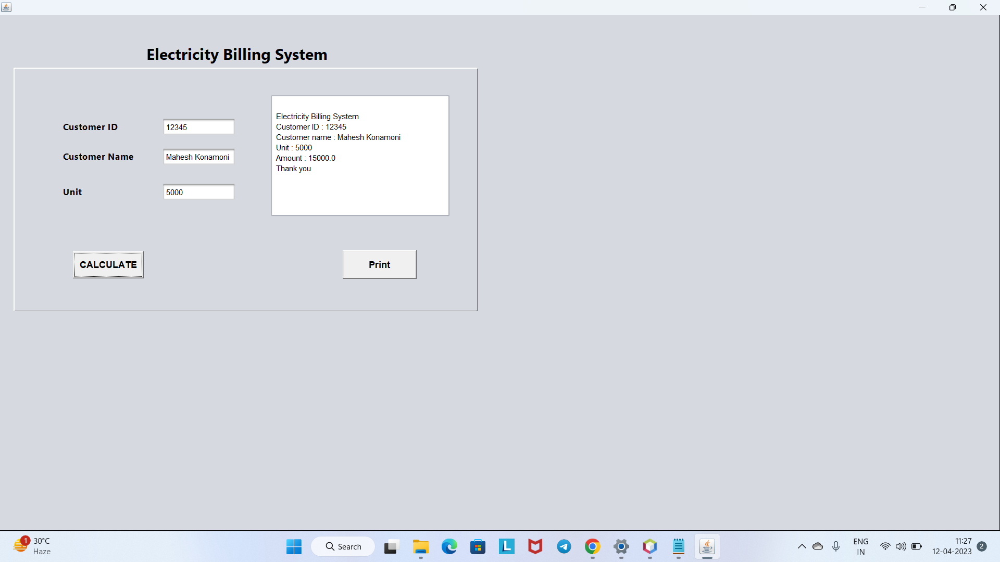
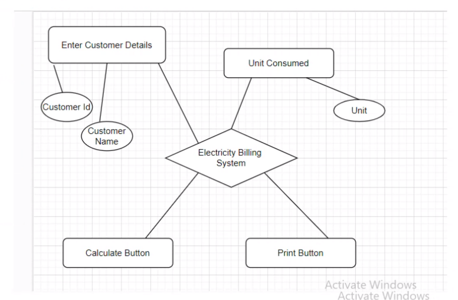

# Electric-city-Management-System

# project-documentation

  

<h3 align="center">Electric-city-Management-System</h3>

 Few lines describing your project.
  
  
  The purpose of the project is to build an application program to reduce the manual work for managing the amount of units consumed by the customers and generating the electricity bill according to the type of customer – individual or commercial. It displays the details of the customers, units consumed by them and bill history. It enables them pay their bill if not paid. The date of payment will be updated while paying the bill. It maintains error free database and easily incorporates the future  
developments and changes.
  
  
  

  Electricity Billing System Project in Java is a software-based application developed in Java programming language. The project aims at serving the department of electricity by computerizing the billing system. It mainly focuses on the calculation of Units consumed during the specified time and the money to be paid to electricity offices. This computerized system will make the overall billing system easy, accessible, comfortable and effective for consumers.

To design the billing system more service oriented and simple, the following features have been implemented in the project. The application has high speed of performance with accuracy and efficiency.
  
  The software provides facility of data sharing, it does not require any staff as in the conventional system. Once it is installed on the system only the meter readings are to be given by the admin where customer can view all details, it has the provision of security restriction.
  
  The electricity billing software calculates the units consumed by the customer and makes bills, it requires small storage for installation and functioning. There is provision for debugging if any problem is encountered in the system.

The system excludes the need of maintaining paper electricity bill, administrator does not have to keep a manual track of the users, users can pay the amount without visiting the office. Thus, it saves human efforts and resources.
  
  
      

## 📝 Table of Contents
- [About](#about)
- [Getting Started](#getting_started)
- [Deployment](#deployment)
- [Usage](#usage)
- [Flow Chart](#flowchart)
- [TODO](../TODO.md)
- [Contributing](../CONTRIBUTING.md)
- [Authors](#authors)
- [Acknowledgments](#acknowledgement)

## 🧐 About 

Fully Functional E-billing  Online Payment website. The Technology that  we used in the project is  Java, Mysql, JFrames container , JCalender,Graphical User Interface(GUI). There is an one important module in the project is user interface billing system to pay the bill. The data is accessed using database and rendered into the local pdf file format. I took almost 40 - 50 hrs to complete this project. SkillLync helped me by providing the wire-frames for all relevant feature pages

## 🏁 Getting Started 
These instructions will get you a copy of the project up and running on your local machine for development and testing purposes. See [deployment](#deployment) for notes on how to deploy the project on a live system.

### Prerequisites
What things you need to install the software and how to install them.
i) Java
ii) Mysql

### Installing
A step by step series of examples that tell you how to get a development env running.

Java Installation:

1) Go to Chrome and type Oracle java.
2) Go to Official website click on it.
3) It will take to the  Official website on top of right side you will get Download Java click on it.
4) Click on the JDK download link according to your operating system.
5) Check the box to accept the License Agreement. It activates the download button.
6) Click on install buuton to install.
7) After successful installation go to the command prompt.
8) type java --version.
9) It ensures that Java is successfully installed in your system.

Netbeans IDE installation:

1) Go to Chrome and type Netbeans java.
2) Go to Official website click on it.
3) It will take to the  Official website on top of left side you will get Download click on it.
4) You can download any type of setup as per your requirements from the above mention web page.
    Right-click on the setup or you can Double-Click on the setup by using the mouse.
5) Click on the next option.
6) Check on the “Private networks, such as my home and work network”.
7) Click on the Allow access button.
8) Check on the “I accept” option and click on the “Next” button.
9) Select the path where you want to install the software and press the “Next” button.
10)  Set the Password, User Name & Ports for the Network Connectivity, or we can use this UserName and the Password for the Connecting the Front-End to the Back-End. 
11)  Click on the “Next” button.
12)  Click on the “Install” button.
13) Wait for the while till the time the setup is properly Installed into the Computer
14) After complication of the setup you can click on the “Finish” button or you can also register the Software, for Further Assistance because it is a Free Software.
15)  Now you can start the NetBeans for further use.

## 🔧 Running the tests 
Explain how to run the automated tests for this system.

1) Click on the Project.
2) go to default package.
3) Go to the project file .
4) Right Click on the project file
5) Click on the Run file to run the project file.

## 🎈 Usage 
Add notes about how to use the system.

1) Creating The Project 
    i) Choose File > New Project 
    ii) In Category Panel Select the java node and in the project pane, choose java application, Click Next.
    iii) Enter the Contact Editor and Enter the project name and specify the project location.
    iv) Click Finish.
    
2) Creating JFrames:
   To add a JFrame container:

           1)In the Projects window, right-click the ContactEditor node and choose New > JFrame Form. Alternatively, you can find a JFrame form by choosing New > Other >               Swing GUI Forms > JFrame Form.

           2)Enter ContactEditorUI as the Class Name.

           3)Enter my.contacteditor as the package.

           4)Click Finish.
           
 When we added the JFrame container, the IDE opened the newly-created ContactEditorUI form in an Editor tab with a toolbar containing several buttons, as shown in the   preceding illustration.
The ContactEditor form opened in the GUI Builder’s Design view and three additional windows appeared automatically along the IDE’s edges, enabling you to navigate, organize, and edit GUI forms as you build them.
 
 The GUI Builder’s various windows include:
 
 1) Design area.
 2) Source code
 3) Pallet area
 4) Navigator
 
 
 If you click the Source button, the IDE displays the application’s Java source code in the Editor with sections of code that are automatically generated by the GUI      Builder indicated by grey areas (they become blue when selected), called Guarded Blocks. 
 Guarded blocks are protected areas that are not editable in Source view. You can only edit code appearing in the white areas of the Editor when in Source view.
  If you need to make changes to the code within a Guarded Block, clicking the Design button returns the IDE’s Editor to the GUI Builder where you can make the necessary adjustments to the form. When you save your changes, the IDE updates the file’s sources.
 
 
 ## 🚀 Deployment 
Add additional notes about how to deploy this on a live system.

i) Click on the Project.
ii) go to default package.
iii) Go to the project file .
iv) Right Click on the project file
v) Click on the Run file to run the project file.

## ⛏️ Flow Chart 
 
 
 - [Java](https://www.java.com/) - Java
- [Mysql](https://Mysql.com/) - Mysql
- [Netbeans](https://Netbeans.org/) - Netbeans IDE

 ## ✍️ Authors 
- [@SkillLymc](https://github.com/konamonimahesh) - FSD

See also the list of [contributors](https://github.com/konamonimahesh/The-Documentation-Compendium/contributors) who participated in this project.

## 🎉 Acknowledgements 
- Hat tip to anyone whose code was used
- Inspiration
     I took the inspiration from the junie Denny solomon madam and Bhupendra pharihar sir from the Skill-lync  
     To complete the project they helped me alot.

- References
    I refered the some youtube lectures videos and read  some documentation about java and Mysql languages.

